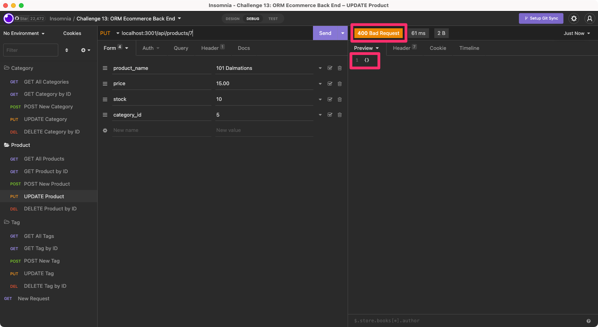

# Challenge 13: Object-Relational Mapping (ORM): E-Commerce Back End

## Table of Contents

- [Overview](#overview)
  - [The Challenge](#the-challenge)
  - [User Story](#user-story)
  - [Acceptance Criteria](#acceptance-criteria)
  - [Screenshot](#screenshot)
  - [Links](#links)
- [My Process](#my-process)
  - [Built With](#built-with)
  - [What I Learned](#what-i-learned)
  - [Continued Development](#continued-development)
  - [Useful Resources](#useful-resources)
- [Author](#author)
- [Acknowledgments](#acknowledgments)

## Overview

### The Challenge

> Internet retail, also known as e-commerce, is the largest sector of the electronics industry, generating an estimated $29 trillion in 2019. E-commerce platforms like Shopify and WooCommerce provide a suite of services to businesses of all sizes. Due to their prevalence, understanding the fundamental architecture of these platforms will benefit you as a full-stack web developer.

> Your task is to build the back end for an e-commerce site by modifying starter code. You’ll configure a working Express.js API to use Sequelize to interact with a MySQL database.

> Because this application won’t be deployed, you’ll also need to provide a link to a walkthrough video that demonstrates its functionality and all of the acceptance criteria being met. You’ll need to submit a link to the video and add it to the readme of your project.

### User Story

```md
AS A manager at an internet retail company
I WANT a back end for my e-commerce website that uses the latest technologies
SO THAT my company can compete with other e-commerce companies
```

### Acceptance Criteria

```md
GIVEN a functional Express.js API
WHEN I add my database name, MySQL username, and MySQL password to an environment variable file
THEN I am able to connect to a database using Sequelize
WHEN I enter schema and seed commands
THEN a development database is created and is seeded with test data
WHEN I enter the command to invoke the application
THEN my server is started and the Sequelize models are synced to the MySQL database
WHEN I open API GET routes in Insomnia for categories, products, or tags
THEN the data for each of these routes is displayed in a formatted JSON
WHEN I test API POST, PUT, and DELETE routes in Insomnia
THEN I am able to successfully create, update, and delete data in my database
```

### Screenshot


### Links

- Solution URL: [https://github.com/anakela/orm-ecommerce-back-end](https://github.com/anakela/orm-ecommerce-back-end)

## My Process

### Built With

- JavaScript
- Express.js
- Node.js
- Sequelize.js
- MySQL
- DOTENV

### What I Learned

This challenge gave me a much better understanding of routes and models and how they interact.  In addition, I was able to practice using `Sequelize` rather than `MySQL` to query the database, something that I haven't been very comfortable with in the past.

Being able to use and understand `express` routes to GET, POST, PUT, and DELETE database items was a very interesting aspect of this project.  For the most part, they worked very well.

That being said, had difficulty with two of my routes/database queries:
- GET - Update Product
- GET - Update Tag

For both of these, I received `400 Bad Request` errors for both of these requests, and was shown empty objects in Insomnia's preview window.  When I checked the database in MySQL Workbench, however, the changes to the database were actually rendered.  (This can be seen in the walkthrough video as well as the screenshots below.)

Before updating the `product` table:


After sending the `product` table update request:



I hope to figure out what is causing this issue, though it has been difficult so far as `node` has not thrown me any errors in the terminal.

### Continued Development

In the future, I would love to practice ORM in additional projects and challenges.  I believe using ORM with handlebars would be especially interesting!

### Useful Resources

- [BobbyHadz.com: Solve - Cannot read property 'filter' of Undefined in JS](https://bobbyhadz.com/blog/javascript-cannot-read-property-filter-of-undefined)
- [GitHub: JSON POST request using app sends empty body](https://github.com/postmanlabs/postman-app-support/issues/8455)
- [Insomnia](https://insomnia.rest/)
- [Postman](https://www.postman.com/)
- [Sequelize: Model Querying - Basics](https://sequelize.org/docs/v6/core-concepts/model-querying-basics/)
- [Stack Abuse: Using Sequelize ORM with Node.js and Express](https://stackabuse.com/using-sequelize-orm-with-nodejs-and-express/)
- [Stack Overflow: Sequelize findByPk returns null](https://stackoverflow.com/questions/58442948/sequelize-findbypk-returns-null)
- [White Oak Security: How To Prepare for an API Pentest – Insomnia](https://www.whiteoaksecurity.com/blog/how-to-prepare-for-an-api-pentest-insomnia/)

## Author

- GitHub - [https://github.com/anakela](https://github.com/anakela)
- LinkedIn - [https://www.linkedin.com/in/anakela/](https://www.linkedin.com/in/anakela/)

## Acknowledgments

- Fellow Bootcampers
  - Asha Chakra
  - Nolan Spence
- Matthew Kaus (TA)
- Bobbi Tarkany (Tutor)